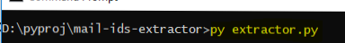
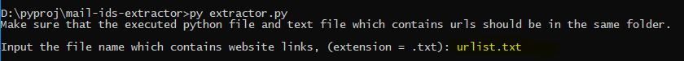
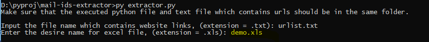

# Mail Ids Extractor

In a nutshell, It extracts e-mail ids from a given website and feeds them into a Excel Sheet.

## Getting Started

These instructions will get you a copy of the project up and running on your local machine for development and testing purposes.
### Prerequisites

Libraries you need to install before you even execute the extractor.py script.
```
beautifulsoup4==4.7.1
bs4==0.0.1
lxml==4.3.2
requests==2.21.0
soupsieve==1.8
urllib3==1.24.1
xlrd==1.2.0
xlwt==1.3.0
```

### Downloading

You can download the project files by clicking on "Clone or download" > "Download ZIP".

### Installing

#### Step 1

Unzip the downloaded file and cd into the folder on your "Terminal or Command prompt" where you've downloaded it.

Example:
```
cd D:\FOLDER-CONTAING-PROJECT-FILES\
```
```
D:\FOLDER-CONTAING-PROJECT-FILES>
```

#### Step2

Execute the command below on you Command "Prompt or Terminal" to download and install the libraries on your local machine with the help of "pip". Make sure that Python and Pip are installed on you local machine.

```
pip install -r requirements.txt --no-index
```

## Running the tests

To run the tests, below steps to be followed

### Step 1

Executing the extractor.py



Hit enter after entering the command above.

### Stpe 2

Entering the text (.txt) file which contains website links line by line.



Hit enter after entering the input file name.

### Stpe 3

Entering the text (.txt) file which contains website links line by line.



Hit enter after entering the desired file name for ouptput.

## Built With

* [Python](https://www.python.org/downloads/) - For setting up the Python Environment on you local machine
* [beautifulsoup4==4.7.1](https://pypi.org/project/beautifulsoup4/) - BeautifulSoup Librariy is used for parsing the HTML file
* [lxml==4.3.2](https://pypi.org/project/lxml/) - Pythonic XML processing library
* [requests==2.21.0](https://pypi.org/project/requests/) - Allows you to send http/https requests
* [urllib3==1.24.1](https://pypi.org/project/urllib3/) - Used for parsing the URL
* [xlwt==1.3.0](https://pypi.org/project/xlwt/) - To generate Excel shpreadsheet file

## Disclaimer

Web scraping and crawling aren't illegal by themselves. After all, you could scrape or crawl your own website, without a hitch. - [Rami Essaid](https://resources.distilnetworks.com/all-blog-posts/is-web-scraping-illegal-depends-on-what-the-meaning-of-the-word-is-is)

## Author

* **Sampath Kumar Ajjapaga** 
